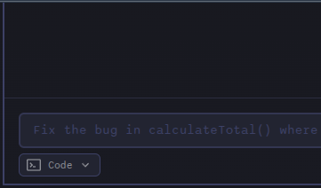
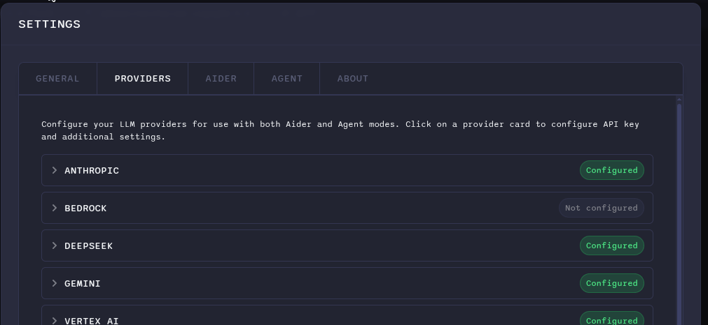
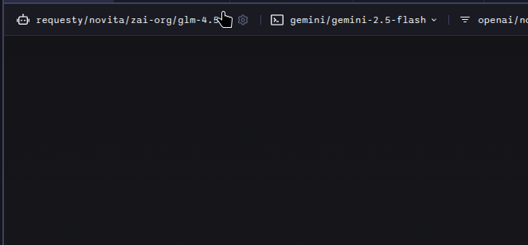
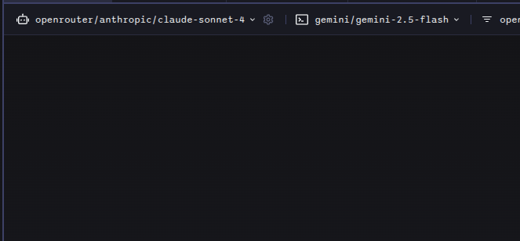

# How to Use Agent Mode

This guide will walk you through setting up and using Agent Mode, from switching to Agent Mode to configuring your model provider and selecting the right model for your task.

## Switching to Agent Mode

Before you can use Agent Mode, you need to switch to it from the regular chat mode. You can do this in two ways:

### 1. Using the Mode Selector

Click on the mode selector located below the prompt field and choose "Agent" from the available options.

### 2. Using the Command

Type `/agent` in the prompt field and press Enter. Any text following the command will be used as the initial prompt for the agent.

Once in Agent Mode, you're ready to configure your model provider and select a model.

## Configuring a Model Provider

Before you can use Agent Mode, you need to configure at least one Language Model (LLM) provider.

1. Go to **Settings > Model Providers**.
2. Select a provider from the list (e.g., OpenAI, Anthropic).
3. Enter your API key and any other required information for that provider.

## Selecting a Model in Model selector

### 1. Choose from the List

For some providers, AiderDesk will show a list of common models in a dropdown menu. Simply click the dropdown and select the model you want to use.

### 2. Enter a Custom Model

If the model you want to use isn't in the list, you can enter it manually. This is common for providers like OpenAI-Compatible, OpenRouter, or when you have access to a new or private model.

To do this:

1. Click on the model selector.
2. Type the full model name, including the provider prefix (e.g., `anthropic/claude-opus-4-20250514`).
3. Press **Enter** to confirm your selection.

The model you choose will now be set for the current agent profile and it will be added to the top of the selector list for future use.

## Provider Prefixes

When entering a custom model, you must include the correct prefix for the provider. Here is a list of the available provider prefixes:

- `anthropic/`
- `bedrock/`
- `deepseek/`
- `gemini/`
- `vertex-ai/`
- `groq/`
- `lmstudio/`
- `ollama/`
- `openai/`
- `openai-compatible/`
- `openrouter/`
- `requesty/`
