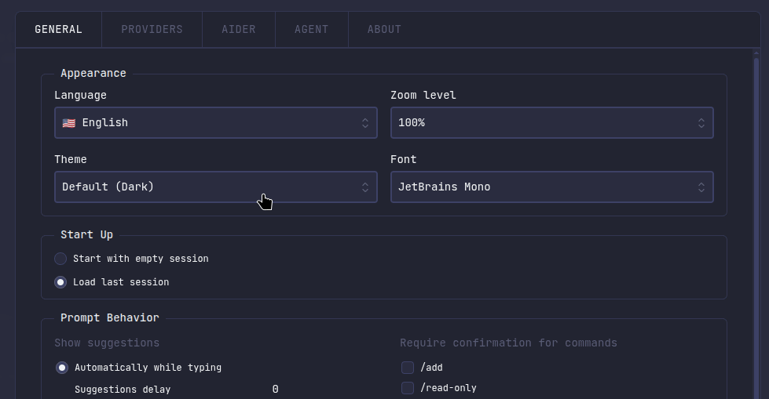
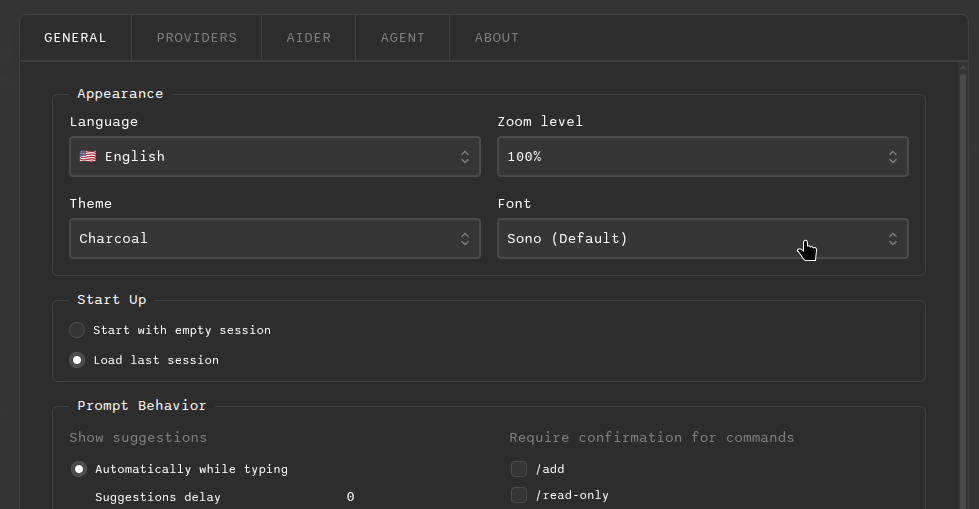

# Look and Feel

AiderDesk provides extensive customization options for themes and fonts, allowing you to personalize the application's appearance to match your preferences and workflow.

## Overview

The Look and Feel settings in AiderDesk are built on a flexible CSS custom properties system that enables:

- **Dynamic theme switching** without application restart
- **Comprehensive color theming** covering all UI elements
- **Font customization** with real-time preview
- **Consistent design language** across all components

## Themes

### How Themes Work

AiderDesk themes are implemented using CSS custom properties (variables) that define the complete color palette for the application. Each theme is a self-contained SCSS file that defines:

- **Background colors** (primary, secondary, tertiary, etc.)
- **Text colors** (primary, secondary, muted, etc.)
- **Border colors** and accents
- **Interactive states** (buttons, inputs, selections)
- **Status colors** (success, warning, error, info)
- **Specialized colors** for code blocks, diff viewers, and agent indicators

When you select a theme, AiderDesk applies the corresponding CSS class to the document body, which activates all the color variables defined in that theme.

### Available Themes

AiderDesk includes 14 carefully crafted themes:

#### Dark Themes
- **Dark** - The default theme with balanced contrast and modern appearance
- **Charcoal** - A sophisticated dark gray theme with warm undertones
- **Midnight** - Deep black theme with high contrast for focused work
- **Neon** - Vibrant theme inspired by cyberpunk aesthetics
- **Neopunk** - Futuristic dark theme with bold accent colors
- **Ocean** - Deep blue theme reminiscent of ocean depths

#### Light Themes
- **Light** - Clean, minimal light theme with excellent readability
- **BW (Black & White)** - High-contrast monochrome theme
- **Serenity** - Calming light theme with soft, muted colors
- **Cappuccino** - Warm, coffee-inspired light theme

#### Colorful Themes
- **Aurora** - Ethereal theme inspired by northern lights
- **Forest** - Nature-inspired green theme
- **Lavender** - Purple-themed interface with calming aesthetics

### Switching Themes

1. Open **Settings** from the main menu
2. Navigate to the **General** section
3. Under **GUI Settings**, select your preferred theme from the dropdown
4. The theme applies immediately without restart


*Theme selection interface showing available themes*

## Fonts

### How Fonts Work

AiderDesk's font system is built on web fonts with CSS custom properties:

- **Font Files**: All fonts are included as TrueType (.ttf) files
- **@font-face Declarations**: Each font is properly declared in CSS for cross-browser compatibility
- **CSS Variables**: Fonts are applied using the `--font-family` custom property
- **Monospace Fallback**: All fonts include `monospace` as a fallback for consistency

### Available Fonts

AiderDesk includes 19 carefully selected fonts covering various styles:

#### Monospace/Code Fonts
- **Sono** - The default font, modern and highly readable
- **JetBrains Mono** - Developer-focused font with ligatures
- **Roboto Mono** - Clean, neutral monospace font
- **Source Code Pro** - Adobe's open-source coding font
- **Space Mono** - Quirky, distinctive monospace font
- **Ubuntu Mono** - Part of the Ubuntu font family
- **Fira Code** - Programming font with code ligatures

#### Sans-Serif Fonts
- **Inter** - Highly readable modern sans-serif
- **Poppins** - Geometric sans-serif with friendly appearance
- **Nunito** - Well-balanced sans-serif with rounded terminals
- **Quicksand** - Light, airy sans-serif font
- **Space Grotesk** - Modern geometric sans-serif
- **Google Sans Code** - Google's coding-optimized sans-serif
- **Sansation** - Clean, professional sans-serif

#### Serif & Display Fonts
- **Lora** - Elegant serif font suitable for long reading
- **Playfair Display** - High-contrast serif for headings
- **Orbitron** - Futuristic display font
- **Enriqueta** - Classic serif with modern proportions
- **Silkscreen** - Retro pixel-art style display font

### Switching Fonts

1. Open **Settings** from the main menu
2. Navigate to the **General** section
3. Under **GUI Settings**, select your preferred font from the dropdown
4. The font applies immediately across the entire application


*Font selection interface with live preview of each font*

## Contributing: Adding New Themes

### Adding a New Theme

To contribute a new theme to AiderDesk, follow these steps:

#### 1. Create the Theme SCSS File

Create a new file in `src/renderer/src/themes/` following the naming convention:
```scss
// src/renderer/src/themes/theme-your-theme-name.scss
.theme-your-theme-name {
  // Background colors
  --color-bg-primary: #your-primary-bg-color;
  --color-bg-primary-light: #your-light-bg-color;
  --color-bg-primary-light-strong: #your-strong-bg-color;
  --color-bg-secondary: #your-secondary-bg-color;
  --color-bg-secondary-light: #your-secondary-light-bg-color;
  --color-bg-secondary-light-strongest: #your-secondary-strongest-bg-color;
  --color-bg-tertiary: #your-tertiary-bg-color;
  --color-bg-tertiary-emphasis: #your-tertiary-emphasis-color;
  --color-bg-tertiary-strong: #your-tertiary-strong-color;
  // ... continue with all background color variables

  // Text colors
  --color-text-primary: #your-primary-text-color;
  --color-text-secondary: #your-secondary-text-color;
  --color-text-tertiary: #your-tertiary-text-color;
  // ... continue with all text color variables

  // Border colors
  --color-border-default: #your-default-border-color;
  --color-border-accent: #your-accent-border-color;
  // ... continue with border colors

  // Interactive colors
  --color-button-primary: #your-primary-button-color;
  --color-button-primary-text: #your-primary-button-text-color;
  // ... continue with button colors

  // Status colors
  --color-success: #your-success-color;
  --color-warning: #your-warning-color;
  --color-error: #your-error-color;
  --color-info: #your-info-color;

  // Agent-specific colors
  --color-agent-auto-approve: #your-auto-approve-color;
  --color-agent-aider-tools: #your-aider-tools-color;
  --color-agent-power-tools: #your-power-tools-color;
  --color-agent-todo-tools: #your-todo-tools-color;
  --color-agent-context-files: #your-context-files-color;
  --color-agent-repo-map: #your-repo-map-color;
  // ... continue with agent colors
}
```

#### 2. Import the Theme

Add your theme to the themes import file:
```scss
// src/renderer/src/themes/themes.scss
@use 'theme-your-theme-name.scss'; // Add this line
```

#### 3. Update the Theme List

Add your theme to the TypeScript types:
```typescript
// src/common/types.ts
export const THEMES = [
  'dark',
  'light',
  'charcoal',
  // ... existing themes
  'your-theme-name', // Add this line
] as const;
```

#### 4. Add Translation

Add your theme name to the translation files:
```json
// src/common/locales/en.json
{
  "settings": {
    "themeOptions": {
      "your-theme-name": "Your Theme Display Name"
    }
  }
}
```

#### 5. Testing Requirements

Before submitting your theme, ensure it:

- ✅ Provides sufficient contrast for accessibility (WCAG AA standards)
- ✅ Works well in all major UI components
- ✅ Maintains readability in both light and dark contexts
- ✅ Includes all required color variables
- ✅ Is tested across different screen sizes
- ✅ Works with all available fonts

### Theme Design Guidelines

- **Contrast Ratio**: Maintain at least 4.5:1 for normal text and 3:1 for large text
- **Color Harmony**: Use a cohesive color palette with proper relationships
- **Consistency**: Follow the established color hierarchy and naming conventions
- **Accessibility**: Ensure color combinations are accessible to colorblind users
- **Performance**: Use hex colors for optimal performance

## Contributing: Adding New Fonts

### Adding a New Font

To contribute a new font to AiderDesk, follow these steps:

#### 1. Obtain the Font File

- Ensure you have the legal right to distribute the font (open-source license preferred)
- Obtain the font in TrueType (.ttf) format
- Verify the font includes all necessary characters and glyphs

#### 2. Add Font File

Place the font file in the fonts directory:
```
src/renderer/src/fonts/YourFontName.ttf
```

#### 3. Update Font CSS

Add the font declaration to the fonts CSS file:
```css
/* src/renderer/src/fonts.css */
@font-face {
  font-family: 'YourFontName';
  src: url('./fonts/YourFontName.ttf') format('truetype');
  font-weight: 400;
  font-style: normal;
}
```

#### 4. Update the Font List

Add your font to the TypeScript types:
```typescript
// src/common/types.ts
export const FONTS = [
  'Sono',
  'Poppins',
  // ... existing fonts
  'YourFontName', // Add this line
] as const;
```

#### 5. Add Translation

Add your font name to the translation files:
```json
// src/common/locales/en.json
{
  "settings": {
    "fontOptions": {
      "yourFontName": "Your Font Display Name"
    }
  }
}
```

#### 6. Testing Requirements

Before submitting your font, ensure it:

- ✅ Renders correctly across all operating systems
- ✅ Maintains readability at various sizes
- ✅ Works well with all available themes
- ✅ Includes proper character coverage for your target languages
- ✅ Has reasonable file size (< 1MB preferred)
- ✅ Is properly licensed for open-source distribution

### Font Selection Guidelines

- **Readability**: Prioritize fonts that are easy to read for long periods
- **Character Support**: Ensure coverage of common programming characters and symbols
- **Performance**: Consider font file size and loading impact
- **Licensing**: Prefer fonts with permissive open-source licenses (MIT, OFL, Apache)
- **Variety**: Add fonts that bring unique styles and use cases

### Recommended Font Sources

- **Google Fonts**: Large collection of free, open-source fonts
- **Adobe Fonts**: High-quality fonts (check licensing)
- **Font Squirrel**: Curated collection of free fonts
- **GitHub**: Many open-source font projects available

## Troubleshooting

### Theme Issues

If you encounter issues with themes:

1. **Theme not applying**: Check that the theme file is properly imported in `themes.scss`
2. **Colors not working**: Verify all required CSS variables are defined
3. **Contrast issues**: Use browser dev tools to check contrast ratios
4. **Missing elements**: Ensure all color variables from the reference theme are included

### Font Issues

If you encounter issues with fonts:

1. **Font not loading**: Check the font file path in the `@font-face` declaration
2. **Font not appearing**: Verify the font name matches exactly in CSS and TypeScript
3. **Rendering issues**: Test the font across different browsers and operating systems
4. **Licensing concerns**: Double-check the font's license allows for distribution

## Best Practices

### For Users

- **Consistency**: Choose a theme and font combination that you'll use consistently
- **Accessibility**: Prioritize readability and contrast over aesthetics
- **Environment**: Consider your lighting conditions when choosing between light and dark themes
- **Performance**: Lighter themes may consume slightly less battery on OLED displays

### For Contributors

- **Testing**: Thoroughly test your contributions across different environments
- **Documentation**: Provide clear descriptions of your theme/font design philosophy
- **Maintenance**: Be prepared to maintain your contribution over time
- **Community**: Engage with user feedback and make improvements based on usage

By following these guidelines, you can help make AiderDesk more customizable and enjoyable for everyone in the community.
