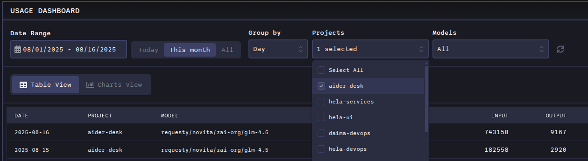
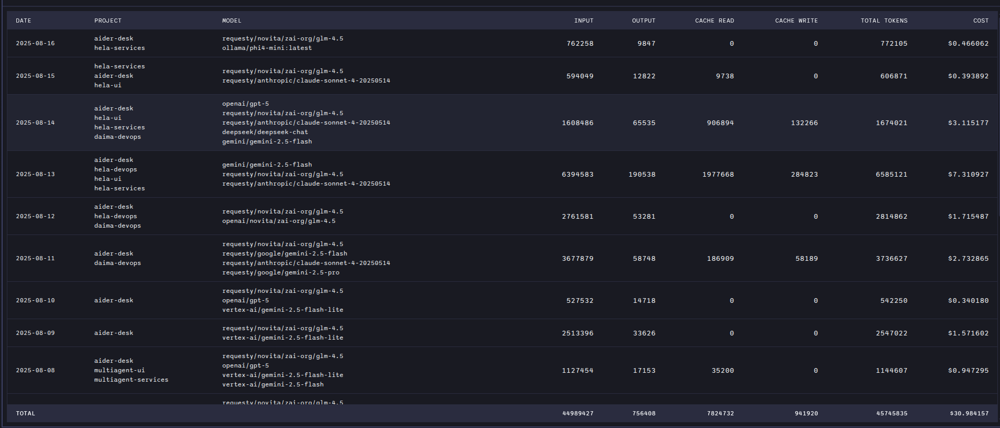
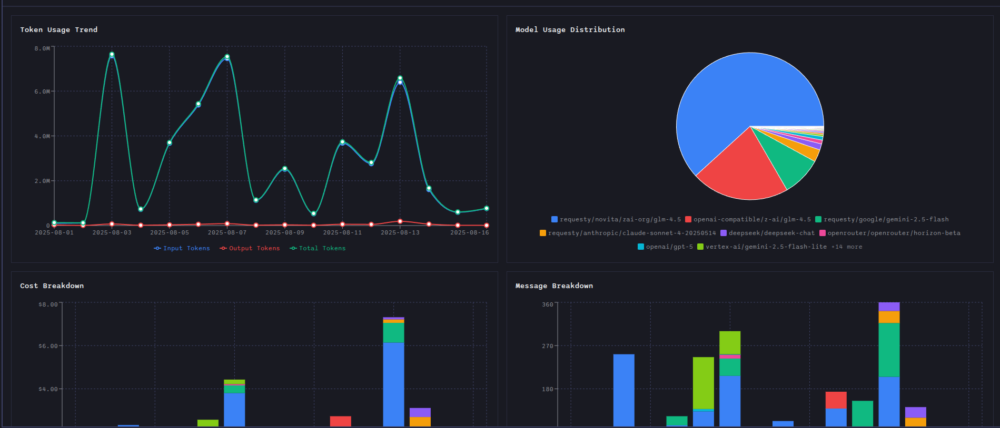

# Usage Dashboard

The Usage Dashboard provides a comprehensive analysis of your AiderDesk activity over time, giving you actionable insights to optimize both your workflow and your budget. Track your usage patterns, monitor costs, and make data-driven decisions about your AI-assisted development.

## Key Features

### Comprehensive Activity Analysis
Monitor your development activity with detailed metrics that help you understand how you're using AiderDesk across different projects and time periods.

### Token Consumption Visualization
Track your token usage with interactive charts that show consumption trends over time. This helps you understand your usage patterns and identify opportunities for optimization.

### Cost Breakdown by Project and Model
Get detailed cost analysis broken down by individual projects and AI models. This granular view helps you allocate resources effectively and identify which projects or models are driving your costs.

### Interactive Usage Patterns
Explore your usage patterns with interactive charts and graphs that allow you to filter by date range, project, model, and other dimensions. Drill down into specific time periods or projects to get deeper insights.

## Dashboard Overview

The Usage Dashboard offers flexible viewing options:

- **Date Range Filters**: View data for custom time periods (today, this month, all time, or custom ranges)
- **Project Filtering**: Focus on specific projects or compare across multiple projects
- **Model Filtering**: Analyze usage by specific AI models
- **Grouping Options**: Group data by hour, day, month, or year for different levels of granularity

## View Modes

The Usage Dashboard offers two distinct view modes to analyze your data:

### Table View
The Table view presents your usage data in a structured, tabular format that allows for detailed analysis and easy data comparison.

**Key features:**
- **Detailed Breakdown**: Comprehensive listing of all usage data with individual entries
- **Flexible Grouping**: Group data by hour, day, month, or year to see aggregated statistics
- **Sortable Columns**: Click column headers to sort by tokens, costs, projects, models, or timestamps
- **Filtering**: Apply project and model filters to focus on specific data subsets
- **Export Ready**: Tabular data format is ideal for export to spreadsheets or other analysis tools

### Charts View
The Charts view transforms your usage data into interactive visualizations that make patterns and trends immediately apparent.

**Available charts:**
- **Token Usage Trend**: Visual representation of token consumption over time with trend analysis
- **Model Usage Distribution**: Pie or bar chart showing usage distribution across different AI models
- **Cost Breakdown**: Detailed breakdown of costs by project and model with comparative analysis
- **Message Breakdown**: Analysis of message patterns and conversation statistics

**Interactive features:**
- **Hover Details**: Hover over chart elements to see detailed metrics
- **Zoom and Pan**: Navigate through time-series data for closer inspection
- **Legend Filtering**: Click legend items to show/hide specific data series
- **Responsive Design**: Charts adapt to different screen sizes and viewing preferences

## Benefits

- **Budget Optimization**: Identify cost drivers and optimize your spending
- **Workflow Improvement**: Understand your usage patterns to streamline your development process
- **Resource Planning**: Make informed decisions about AI model usage and project allocation
- **ROI Tracking**: Measure the value and impact of AI-assisted development on your projects

The Usage Dashboard transforms raw usage data into actionable intelligence, helping you get the most value from your AiderDesk investment.
