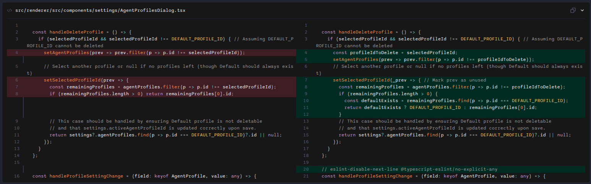

# Reviewing Code Changes

One of AiderDesk's most powerful features is the ability to clearly visualize and manage the code changes proposed by the AI.

## The Diff Viewer

Whenever Aider modifies a file, the changes are presented in a **diff view** within a code block in the chat. This provides a clear, side-by-side comparison of the original code and the new, modified version.

- **Green highlighting** indicates lines that have been **added**.
- **Red highlighting** indicates lines that have been **removed**.
- **Darker shades** within a highlighted line pinpoint the exact characters that were changed.

This visual format makes it easy to quickly assess the impact and correctness of the AI's modifications.



## Understanding Aider's Diff Format

When Aider makes a change, it often uses a specific format within the code block to represent the edit:

```
<<<<<<< SEARCH
// Original code to be replaced
=======
// New code to insert
>>>>>>> REPLACE
```

AiderDesk automatically parses this format and renders it in the user-friendly diff viewer, so you don't have to read the raw diff syntax yourself.

## Reverting Changes

You have granular control over which changes to accept. If you disagree with a specific modification proposed by the AI, you can easily revert it.

1.  Hover over the code block containing the change you want to undo.
2.  An **Undo** icon (<svg xmlns="http://www.w3.org/2000/svg" width="16" height="16" fill="currentColor" class="bi bi-arrow-counterclockwise" viewBox="0 0 16 16"><path fill-rule="evenodd" d="M8 3a5 5 0 1 1-4.546 2.914.5.5 0 0 0-.908-.417A6 6 0 1 0 8 2v1z"/><path d="M8 4.466V.534a.25.25 0 0 0-.41-.192L5.23 2.308a.25.25 0 0 0 0 .384l2.36 1.966A.25.25 0 0 0 8 4.466z"/></svg>) will appear in the top-right corner of the block.
3.  Click the icon.

AiderDesk will immediately apply the revert, replacing the AI's new code with the original code in the actual file on your disk. This action is instant and allows you to selectively accept or reject parts of the AI's work.
